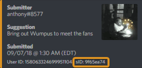
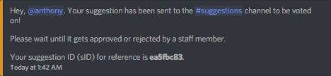
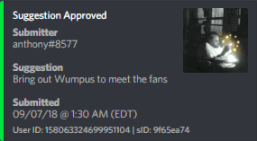
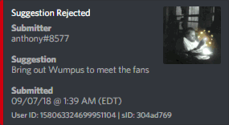
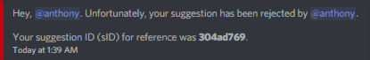
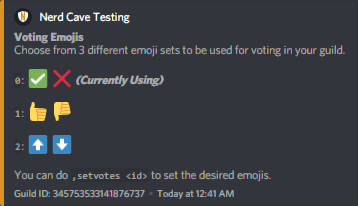
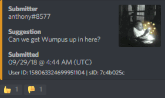

# Managing Suggestions

Managing suggestions are simple. Each suggestion is assigned a **Suggestion ID** \(sID\). From there, staff members can either reject or approve a suggestion with the sID. The sID is located in the footer of each suggestion: 

## Approving Suggestions

Suggestions are approved via the sID. Once you have it, run the command`,approve <ID>`. Afterward, series of actions will happen:

* The suggestion will update as "Approved" in the suggestions channel and shortly delete itself afterward
* The user will receive a DM that you approved their suggestion
* The results of that suggestion will be logged in the suggestions logs channel

It seems like a lot doesn't it? It really isn't because it all happens in the matter of seconds!

## Rejecting Suggestions

Rejecting suggestions work the same way as approving suggestions. Once you run the command`,reject <ID>`the same series of actions will happen as stated above, just instead information of the suggestion being rejected will be posted.

## Suggestions Logging

When a suggestion is approved or rejected, it's results are logged to the suggestions logs channel you set earlier. In that channel, you'll find this information for each result:

* The results \(both Upvotes and Downvotes\)
* The suggestion
* The submitter
* The staff member that approved or rejected the suggestion
* The sID

## Suggestions Emojis

A newly introduced feature as of September 29, 2018, you have the ability to choose from a predefined list of emojis to be used for your suggestions. Setting this up is really simple. To see the available options as well as the option you have configured,  use the command `,setvotes`

To change to any of these options, you can simply do `,setvotes <#>`\(ex. `,setvotes 2`\). The number is in front of each emoji set. Upon changing, any future suggestions will use that emoji set, as shown below:

